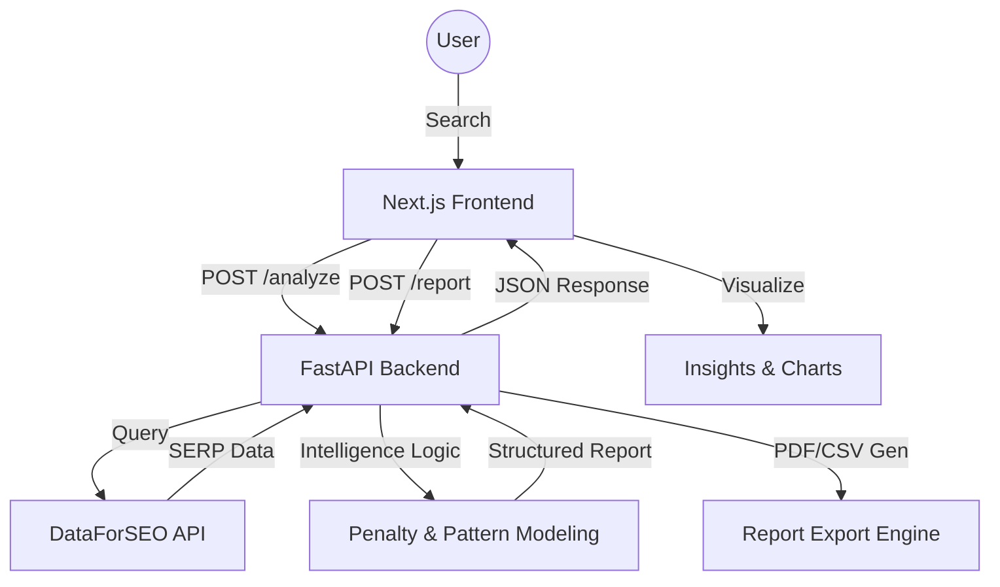

# System Architecture & Workflows

## 📐 System Overview

Startly Analyze is built on a modern decoupled architecture, combining a high-performance Python backend with a reactive React frontend.

## 🧠 Core Working Components

### 1. Intelligence Modeling Engine (`backend/main.py`)
The heart of the application. It orchestrates the transformation of raw API data into actionable insights through three deterministic stages:

#### A. The Saturation Index
We calculate the "Organic Real Estate" share of the SERP to determine how much of the first page is actually accessible to SEO:
$$\text{Saturation Score} = \frac{\text{Organic Results Count}}{\text{Total Items on Page 1}}$$

#### B. Weighted Penalty Tiers (The "Intelligence")
Startly Analyze uses a weighted model to discount search volume based on click-diversion patterns:

| Pattern Detected | Penalty | Rationale |
| :--- | :--- | :--- |
| **Zero-Click** | **45%** | AI Overviews/Answer Boxes satisfy intent immediately, preventing a site visit. |
| **Commercial** | **35%** | Paid advertising diverts high-intent traffic away from organic slots. |
| **Standard Noise** | **20%** | Media carousels (Video, Images) and PAA modules create visual distraction. |

#### C. Pattern Recognition & Narrative
The engine performs linguistic mapping to turn these metrics into "Growth Verdicts" (e.g., "Market Dominant" or "Zero-Click Risk") seen on the dashboard.

### 2. Frontend Intelligence (`frontend/`)
*   **State Management**: Uses React hooks to maintain a history of analyzed keywords, allowing for instant comparisons and landscapes.
*   **Dynamic Visuals**: `Chart.js` is utilized to map the "Demand Disparity" between raw interest and actual capture potential.
*   **Contextual UI**: The `InsightsPanel` performs semantic analysis on report strings to assign categorical icons and colors.

### 3. Export Engine (`backend/report_export.py`)
A specialized workflow using `ReportLab` for pixel-perfect PDF generation and `io` streams for CSV data collation. It mirrors the UI's breakdown to ensure data consistency between the browser and physical reports.

## 🔄 Sequence Workflows

### Keyword Analysis Flow
1.  **Submission**: User enters a keyword and clicks "Analyze".
2.  **Validation**: Frontend sanitizes input and checks cache triggers.
3.  **Backend Processing**:
    *   Check Local Cache (`backend/cache/`).
    *   If Miss: Dispatch API calls to DataForSEO.
    *   Calculate `saturation_score` and `penalty_factor`.
    *   Generate `sections` with narrative intelligence.
4.  **Presentation**: Frontend receives JSON, triggers entry animations, and updates the competitive landscape chart.

### Reporting Flow
1.  **Trigger**: User clicks "Export PDF" or "CSV Dataset".
2.  **Payload**: Frontend sends the current `AnalysisRow` state (no redundant API calls needed).
3.  **Generation**: Backend streams a bytearray of the generated file.
4.  **Download**: Frontend creates a temporary blob URL and triggers a click-to-save event.

## 🛠️ Tech Stack
*   **Frontend**: Next.js, TypeScript, Tailwind CSS, Framer Motion, Chart.js, Lucide.
*   **Backend**: FastAPI (Python 3.10+), Pydantic, HTTPX, ReportLab.
*   **Data**: DataForSEO API.
